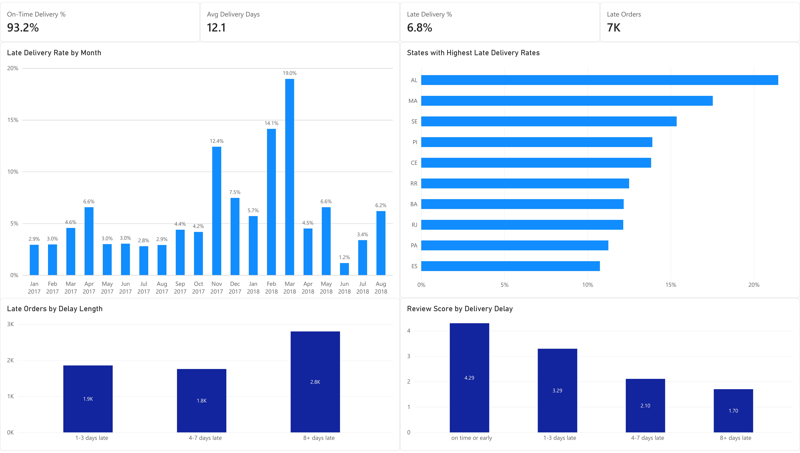
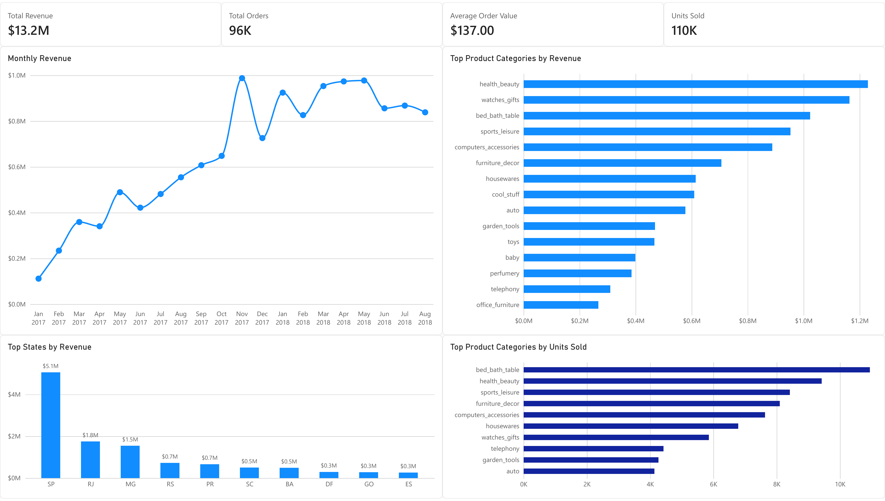
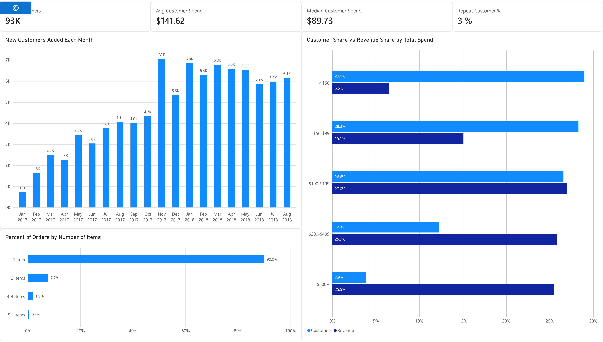

# Olist E-Commerce Analytics Dashboard

E-commerce analytics solution built with PostgreSQL, SQL, Power BI, and DAX to monitor sales performance, delivery issues, and customer behavior.

## Dashboard

### Delivery & Operations



### Revenue & Sales



### Customer Analysis



The interactive report was built in Power BI; screenshots are included here for public portfolio viewing.

## Goal

Build an e-commerce reporting workflow that gives business users a clear view of sales performance, fulfillment issues, and customer behavior.

Raw transactional data is organized into reusable reporting tables and Power BI dashboards so key trends and problem areas can be monitored without repeatedly querying the source data.

## Dashboard Overview

### Delivery & Operations

Tracks delivery performance, late-order trends, regional issues, delay severity, and the relationship between delivery delays and customer review scores.

### Revenue & Sales

Tracks revenue, order volume, average order value, product-category performance, geographic sales trends, and unit volume.

### Customer Analysis

Tracks customer acquisition, average and median customer spend, repeat customers, order size, and how different customer spending levels contribute to overall revenue.

## Key Findings

- 93.2% of delivered orders arrived on time or early, while monthly late-delivery rates showed several significant spikes
- Review scores declined as delivery delays increased, falling from 4.29 for on-time or early orders to 1.70 for delays of 8+ days
- São Paulo generated substantially more revenue than any other state
- Customer acquisition increased throughout 2017 before stabilizing at roughly 6,000–7,000 new customers per month
- Median customer spend was $89.73 compared with an average of $141.62, showing that customer spending is right-skewed
- Customers spending $200 or more represented a relatively small share of customers but contributed more than half of total customer revenue
- 90% of delivered orders contained a single item

## Built With

- PostgreSQL
- SQL
- Power BI
- DAX

## Reporting Workflow

- Loaded the Olist relational dataset into PostgreSQL
- Validated table relationships, missing values, order statuses, and table grain
- Built reusable reporting views for orders, order items, customers, delivery reviews, dates, and cohort analysis
- Loaded reporting tables into Power BI and created a semantic model with reusable DAX measures
- Built a three-page dashboard covering operations, sales, and customer behavior

## Data Notes

- Dashboard analysis begins in 2017 because 2016 contains sparse order activity
- `customer_unique_id` is used to identify customers across multiple orders
- Revenue is calculated from product sales using `order_items.price`
- Delivered orders are used for revenue and delivery-performance reporting
- Raw and exported CSV files are excluded from the repository due to file size

## Files

```text
E-Commerce Dashboard/
├── images/
│   ├── delivery_operations.png
│   ├── revenue_sales.png
│   └── customer_analysis.png
├── sql/
│   ├── 00_data_validation.sql
│   ├── 00_exploration.sql
│   ├── 00_schema.sql
│   ├── 01_delivery_analysis.sql
│   ├── 02_revenue_analysis.sql
│   ├── 03_customer_analysis.sql
│   └── 04_reporting_views.sql
├── .gitattributes
├── .gitignore
└── README.md
```

## Data Source

[Brazilian E-Commerce Public Dataset by Olist](https://www.kaggle.com/datasets/olistbr/brazilian-ecommerce)

The dataset contains approximately 100,000 orders across customers, sellers, products, payments, reviews, and delivery records.
